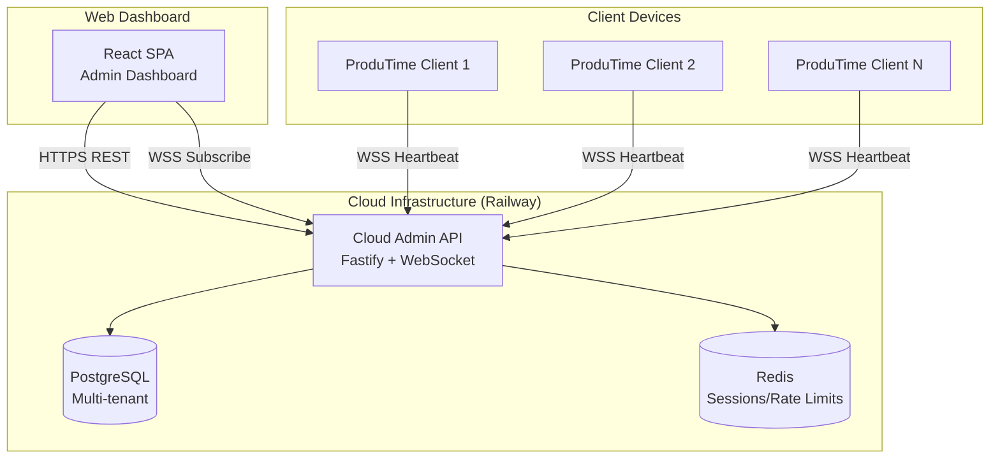

# Design Document: Cloud Admin Console

## Overview

This design transforms the ProduTime Admin Console from a local Electron application to a cloud-hosted multi-tenant web application. The system enables managers to access team productivity dashboards from anywhere while maintaining security, privacy, and tenant isolation.

The architecture leverages the existing Railway deployment infrastructure used by the licensing server, extending it with WebSocket support for real-time client communication and a React-based web dashboard.

## Architecture



### High-Level Flow

1. **Tenant Onboarding**: Operator creates tenant, system generates credentials and WebSocket endpoint
2. **Admin Login**: Manager authenticates via web dashboard, receives JWT tokens
3. **Pairing**: Admin generates pair code, employee enters code in client app, admin approves
4. **Real-time Sync**: Paired clients send heartbeats via WebSocket, dashboard subscribes for updates
5. **Dashboard**: Web UI displays team metrics, attention groups, health scores

## Components and Interfaces

### 1. Cloud Admin API Server

The main API server built with Fastify, handling both REST endpoints and WebSocket connections.

```typescript
// cloud-admin-api/src/index.ts
interface CloudAdminServer {
  // REST endpoints
  POST /api/v1/auth/login
  POST /api/v1/auth/refresh
  POST /api/v1/auth/logout
  
  POST /api/v1/tenants (operator only)
  GET  /api/v1/tenants/:tenantId
  
  POST /api/v1/pairing/generate-code
  POST /api/v1/pairing/request
  POST /api/v1/pairing/approve/:requestId
  POST /api/v1/pairing/deny/:requestId
  GET  /api/v1/pairing/pending
  
  GET  /api/v1/dashboard/story
  GET  /api/v1/dashboard/attention
  GET  /api/v1/dashboard/devices
  GET  /api/v1/dashboard/trends
  GET  /api/v1/dashboard/rankings
  
  // WebSocket endpoints
  WSS /ws/client/:tenantId  // Client heartbeats
  WSS /ws/admin/:tenantId   // Dashboard subscriptions
}
```

### 2. Authentication Service

```typescript
// cloud-admin-api/src/services/auth-service.ts
interface AuthService {
  login(email: string, password: string, captchaToken?: string): Promise<AuthResult>;
  refresh(refreshToken: string): Promise<AuthResult>;
  logout(userId: string): Promise<void>;
  validateToken(token: string): Promise<TokenPayload>;
  checkAccountLock(email: string): Promise<boolean>;
  recordFailedAttempt(email: string, ip: string): Promise<void>;
}

interface AuthResult {
  accessToken: string;
  refreshToken: string;
  expiresIn: number;
  user: {
    id: string;
    email: string;
    tenantId: string;
    tenantName: string;
  };
}

interface TokenPayload {
  userId: string;
  tenantId: string;
  email: string;
  iat: number;
  exp: number;
}
```

### 3. Pairing Service

```typescript
// cloud-admin-api/src/services/pairing-service.ts
interface PairingService {
  generatePairCode(tenantId: string): Promise<PairCodeResult>;
  submitPairRequest(request: PairRequest): Promise<PairRequestResult>;
  approvePairing(requestId: string, adminUserId: string): Promise<ApprovalResult>;
  denyPairing(requestId: string, adminUserId: string): Promise<void>;
  getPendingRequests(tenantId: string): Promise<PendingPairRequest[]>;
  validatePairCode(code: string, tenantId: string): Promise<boolean>;
}

interface PairCodeResult {
  code: string;
  expiresAt: number;
  tenantId: string;
}

interface PairRequest {
  pairCode: string;
  deviceId: string;
  deviceName: string;
  devicePubKey: string;
  appVersion: string;
  osInfo: string;
  captchaToken?: string;
}

interface ApprovalResult {
  success: boolean;
  wsEndpoint: string;
  adminPubKey: string;
  sessionToken: string;
}
```

### 4. WebSocket Connection Manager

```typescript
// cloud-admin-api/src/services/ws-manager.ts
interface WebSocketManager {
  // Client connections (ProduTime apps)
  handleClientConnection(ws: WebSocket, tenantId: string, deviceId: string): void;
  handleClientMessage(deviceId: string, message: SignedMessage): void;
  disconnectClient(deviceId: string): void;
  
  // Admin connections (Dashboard subscriptions)
  handleAdminConnection(ws: WebSocket, tenantId: string, userId: string): void;
  broadcastToAdmins(tenantId: string, event: DashboardEvent): void;
  
  // Connection management
  getConnectedDevices(tenantId: string): string[];
  getConnectionCount(tenantId: string): number;
  cleanupStaleConnections(): void;
}

interface SignedMessage {
  type: string;
  ts: number;
  nonce: string;
  deviceId: string;
  signature: string;
  payload: any;
}

interface DashboardEvent {
  type: 'device_status' | 'metrics_update' | 'attention_change';
  data: any;
}
```

### 5. Dashboard Service

Reuses existing dashboard computation logic from the Electron app.

```typescript
// cloud-admin-api/src/services/dashboard-service.ts
interface DashboardService {
  getDashboardStory(tenantId: string): Promise<DashboardStory>;
  getAttentionGroups(tenantId: string): Promise<AttentionResponse>;
  getDeviceList(tenantId: string): Promise<DeviceListItemEnhanced[]>;
  getTrends(tenantId: string, days: number): Promise<TrendsResponse>;
  getRankings(tenantId: string): Promise<RankingsResponse>;
  ingestHeartbeat(tenantId: string, payload: EnhancedHeartbeatPayload): void;
}
```

### 6. Tenant Service

```typescript
// cloud-admin-api/src/services/tenant-service.ts
interface TenantService {
  createTenant(name: string, adminEmail: string): Promise<TenantResult>;
  getTenant(tenantId: string): Promise<Tenant>;
  updateTenant(tenantId: string, updates: Partial<Tenant>): Promise<Tenant>;
  generateApiCredentials(tenantId: string): Promise<ApiCredentials>;
  getWsEndpoint(tenantId: string): string;
}

interface TenantResult {
  tenantId: string;
  name: string;
  wsEndpoint: string;
  apiKey: string;
  adminUser: {
    email: string;
    temporaryPassword: string;
  };
}

interface Tenant {
  id: string;
  name: string;
  createdAt: number;
  wsEndpoint: string;
  settings: TenantSettings;
}
```

### 7. Validation Middleware

```typescript
// cloud-admin-api/src/middleware/validation.ts
import { z } from 'zod';

const loginSchema = z.object({
  email: z.string().email().max(100),
  password: z.string().min(8).max(100),
  captchaToken: z.string().max(2000).optional(),
});

const pairRequestSchema = z.object({
  pairCode: z.string().length(6).regex(/^\d{6}$/),
  deviceId: z.string().max(100),
  deviceName: z.string().max(100),
  devicePubKey: z.string().max(500),
  appVersion: z.string().max(50),
  osInfo: z.string().max(200),
  captchaToken: z.string().max(2000).optional(),
});

// Validation middleware factory
function validateBody<T>(schema: z.ZodSchema<T>): FastifyMiddleware;
```

### 8. Rate Limiting Middleware

```typescript
// cloud-admin-api/src/middleware/rate-limit.ts
interface RateLimitConfig {
  login: { max: 5, window: '1 minute' };
  loginHourly: { max: 20, window: '1 hour' };
  pairing: { max: 10, window: '1 minute' };
  api: { max: 60, window: '1 minute' };
  wsConnections: { max: 100, perTenant: true };
}
```

### 9. Cleanup Service

```typescript
// cloud-admin-api/src/services/cleanup-service.ts
interface CleanupService {
  runCleanup(): Promise<CleanupResult>;
  scheduleDaily(hour: number): void;
}

interface CleanupResult {
  deletedSessions: number;
  deletedPairCodes: number;
  deletedFailedLogins: number;
  deletedOldLogs: number;
  archivedMetrics: number;
}
```

## Data Models

### Database Schema (PostgreSQL with Prisma)

```prisma
// cloud-admin-api/prisma/schema.prisma

model Tenant {
  id          String   @id @default(uuid())
  name        String   @db.VarChar(100)
  wsEndpoint  String   @unique
  apiKey      String   @unique
  createdAt   DateTime @default(now())
  updatedAt   DateTime @updatedAt
  
  admins      AdminUser[]
  devices     Device[]
  pairCodes   PairCode[]
  pairRequests PairRequest[]
  dailyMetrics DailyMetrics[]
  auditLogs   AuditLog[]
}

model AdminUser {
  id            String   @id @default(uuid())
  tenantId      String
  tenant        Tenant   @relation(fields: [tenantId], references: [id])
  email         String   @db.VarChar(100)
  passwordHash  String
  createdAt     DateTime @default(now())
  lastLoginAt   DateTime?
  lockedUntil   DateTime?
  failedAttempts Int     @default(0)
  
  @@unique([tenantId, email])
  @@index([email])
}

model Device {
  id            String   @id @default(uuid())
  tenantId      String
  tenant        Tenant   @relation(fields: [tenantId], references: [id])
  deviceId      String   // Client-generated device ID
  deviceName    String   @db.VarChar(100)
  devicePubKey  String
  pairedAt      DateTime @default(now())
  lastSeenAt    DateTime?
  status        String   @default("offline") // online, idle, offline
  appVersion    String?  @db.VarChar(50)
  ip            String?  @db.VarChar(45)
  policyId      String?
  revoked       Boolean  @default(false)
  
  dailyMetrics  DailyMetrics[]
  
  @@unique([tenantId, deviceId])
  @@index([tenantId, status])
  @@index([lastSeenAt])
}

model PairCode {
  id        String   @id @default(uuid())
  tenantId  String
  tenant    Tenant   @relation(fields: [tenantId], references: [id])
  code      String   @db.VarChar(6)
  expiresAt DateTime
  usedAt    DateTime?
  createdAt DateTime @default(now())
  
  @@index([tenantId, code])
  @@index([expiresAt])
}

model PairRequest {
  id            String   @id @default(uuid())
  tenantId      String
  tenant        Tenant   @relation(fields: [tenantId], references: [id])
  deviceId      String
  deviceName    String   @db.VarChar(100)
  devicePubKey  String
  appVersion    String   @db.VarChar(50)
  osInfo        String   @db.VarChar(200)
  ip            String   @db.VarChar(45)
  status        String   @default("pending") // pending, approved, denied
  createdAt     DateTime @default(now())
  expiresAt     DateTime
  resolvedAt    DateTime?
  resolvedBy    String?
  
  @@index([tenantId, status])
  @@index([expiresAt])
}

model DailyMetrics {
  id              String   @id @default(uuid())
  tenantId        String
  deviceId        String
  device          Device   @relation(fields: [tenantId, deviceId], references: [tenantId, deviceId])
  tenant          Tenant   @relation(fields: [tenantId], references: [id])
  dateYmd         String   @db.VarChar(10) // YYYY-MM-DD
  activeSeconds   Int      @default(0)
  idleSeconds     Int      @default(0)
  untrackedSeconds Int     @default(0)
  firstActivityTs BigInt?
  lastActivityTs  BigInt?
  topAppsJson     String?  @db.Text
  createdAt       DateTime @default(now())
  updatedAt       DateTime @updatedAt
  
  @@unique([tenantId, deviceId, dateYmd])
  @@index([tenantId, dateYmd])
  @@index([createdAt])
}

model Session {
  id           String   @id @default(uuid())
  userId       String
  tenantId     String
  refreshToken String   @unique
  expiresAt    DateTime
  createdAt    DateTime @default(now())
  
  @@index([userId])
  @@index([expiresAt])
}

model FailedLogin {
  id        String   @id @default(uuid())
  email     String   @db.VarChar(100)
  ip        String   @db.VarChar(45)
  createdAt DateTime @default(now())
  
  @@index([email, createdAt])
  @@index([ip, createdAt])
  @@index([createdAt])
}

model AuditLog {
  id        String   @id @default(uuid())
  tenantId  String
  tenant    Tenant   @relation(fields: [tenantId], references: [id])
  action    String   @db.VarChar(50)
  deviceId  String?
  userId    String?
  details   String   @db.Text
  ip        String?  @db.VarChar(45)
  createdAt DateTime @default(now())
  
  @@index([tenantId, createdAt])
  @@index([createdAt])
}
```

## Correctness Properties

*A property is a characteristic or behavior that should hold true across all valid executions of a system—essentially, a formal statement about what the system should do. Properties serve as the bridge between human-readable specifications and machine-verifiable correctness guarantees.*

### Property 1: Tenant Data Isolation

*For any* two tenants A and B, and any API request authenticated as tenant A, the response SHALL never contain data belonging to tenant B.

**Validates: Requirements 1.1, 5.3**

### Property 2: Tenant ID Uniqueness

*For any* set of created tenants, all Tenant_IDs SHALL be unique (no duplicates).

**Validates: Requirements 1.2**

### Property 3: Tenant Context Validation

*For any* API request without a valid tenant context (missing or invalid tenant ID in JWT), the System SHALL reject the request with 401 or 403.

**Validates: Requirements 1.4**

### Property 4: Login Credential Requirement

*For any* login request missing email or password, the System SHALL reject with 400 validation error.

**Validates: Requirements 2.1**

### Property 5: Password Hashing Security

*For any* stored password, the hash SHALL be a valid bcrypt hash with cost factor >= 12.

**Validates: Requirements 2.2**

### Property 6: JWT Token Expiry Correctness

*For any* successful login, the access token SHALL have expiry within 15 minutes and refresh token within 14 days of issuance.

**Validates: Requirements 2.3**

### Property 7: CAPTCHA Enforcement

*For any* login or pairing request when CAPTCHA_ENABLED is true, requests without valid captchaToken SHALL be rejected.

**Validates: Requirements 2.5, 3.5**

### Property 8: Token Error Safety

*For any* request with an invalid JWT token, the error response SHALL not contain the token value or internal token details.

**Validates: Requirements 2.7**

### Property 9: Pair Code Format and Expiry

*For any* generated pair code, it SHALL be exactly 6 digits and have expiry time 5 minutes from generation.

**Validates: Requirements 3.1**

### Property 10: Pair Code Tenant Association

*For any* pair code, it SHALL only be valid for the tenant that generated it.

**Validates: Requirements 3.2**

### Property 11: Pairing Request Creation

*For any* valid pair request with correct code, a pending pairing request SHALL be created in the database.

**Validates: Requirements 3.3**

### Property 12: Key Exchange on Approval

*For any* approved pairing, both the device record and approval response SHALL contain the exchanged public keys.

**Validates: Requirements 3.6**

### Property 13: WebSocket URL in Approval

*For any* approved pairing response, it SHALL contain a valid WSS endpoint URL.

**Validates: Requirements 3.7**

### Property 14: Pair Code Error Uniformity

*For any* invalid or expired pair code, the error response SHALL be identical (same message, same timing) to prevent enumeration.

**Validates: Requirements 3.9**

### Property 15: Signature Verification

*For any* WebSocket message from a client, if the Ed25519 signature is invalid, the message SHALL be rejected and connection terminated.

**Validates: Requirements 4.2, 4.4, 4.5**

### Property 16: Unpaired Device Rejection

*For any* WebSocket connection attempt from a device ID not in the paired devices list, the connection SHALL be rejected.

**Validates: Requirements 4.3**

### Property 17: Dashboard Mode Computation

*For any* combination of device count, heartbeat status, expected seconds, and active seconds, the computed dashboard mode SHALL match the deterministic rules: NO_DEVICES → NO_DATA_YET → PRE_SHIFT → IN_SHIFT_NO_ACTIVITY → NORMAL.

**Validates: Requirements 5.4**

### Property 18: Input Validation

*For any* request body, strings exceeding character limits SHALL be rejected, control characters SHALL be rejected, and unknown fields SHALL be stripped.

**Validates: Requirements 6.1, 6.2, 6.3, 6.4, 6.6**

### Property 19: Error Response Safety

*For any* error response, it SHALL not contain stack traces, SQL queries, table names, or filesystem paths.

**Validates: Requirements 7.2, 7.3, 7.5**

### Property 20: Cleanup Removes Old Records

*For any* execution of the cleanup job, all records older than 30 days in sessions, pair codes, and failed logins tables SHALL be deleted.

**Validates: Requirements 8.2**

### Property 21: Cleanup Preserves Latest Status

*For any* device after cleanup, the latest status record SHALL be preserved while older status records are removed.

**Validates: Requirements 8.3**

### Property 22: Cleanup Idempotence

*For any* database state, running cleanup twice SHALL produce the same result as running it once.

**Validates: Requirements 8.6**

### Property 23: Privacy - No Titles by Default

*For any* heartbeat payload when title sharing is disabled, the payload SHALL not contain window title data.

**Validates: Requirements 9.1, 9.2, 9.4**

### Property 24: Tenant Credential Uniqueness

*For any* set of created tenants, all API keys and WebSocket endpoints SHALL be unique.

**Validates: Requirements 10.1, 10.4**

### Property 25: Tenant Admin Creation

*For any* newly created tenant, exactly one admin user SHALL exist with the specified email.

**Validates: Requirements 10.2**

## Error Handling

### Error Response Format

All errors follow a consistent format:

```typescript
interface ErrorResponse {
  error: ErrorCode;
  message: string;
  requestId?: string;
}

type ErrorCode = 
  | 'VALIDATION_ERROR'    // 400
  | 'UNAUTHORIZED'        // 401
  | 'FORBIDDEN'           // 403
  | 'NOT_FOUND'           // 404
  | 'RATE_LIMITED'        // 429
  | 'SERVER_ERROR';       // 500
```

### Error Handling Strategy

1. **Validation Errors**: Return 400 with generic "Invalid input" message
2. **Authentication Errors**: Return 401 with "Unauthorized" - never reveal if email exists
3. **Authorization Errors**: Return 403 with "Forbidden" - never reveal resource existence
4. **Rate Limit Errors**: Return 429 with "Too many requests" and Retry-After header
5. **Server Errors**: Return 500 with "Internal server error" - log details server-side only

### Sensitive Data Protection

- Never log passwords, tokens, or private keys
- Sanitize error messages before logging (remove SQL, paths)
- Use request IDs for correlation without exposing internals

## Testing Strategy

### Unit Tests

Unit tests verify specific examples and edge cases:

- Authentication service: login success/failure, token validation, account locking
- Pairing service: code generation, request validation, approval flow
- Dashboard service: mode computation, health score calculation
- Validation middleware: schema validation, character limits
- Cleanup service: record deletion, idempotence

### Property-Based Tests

Property-based tests verify universal properties across all inputs using fast-check:

- **Tenant isolation**: Generate random tenant pairs and data, verify no cross-tenant leakage
- **Input validation**: Generate random strings with control characters, verify rejection
- **Signature verification**: Generate random messages with invalid signatures, verify rejection
- **Cleanup idempotence**: Generate random database states, verify cleanup(cleanup(state)) == cleanup(state)
- **Dashboard mode**: Generate random input combinations, verify mode computation matches rules

### Integration Tests

- Full pairing flow: generate code → submit request → approve → verify connection
- Authentication flow: login → access API → refresh → logout
- WebSocket communication: connect → send heartbeat → verify dashboard update

### Test Configuration

- Property tests: minimum 100 iterations per property
- Each property test tagged with: **Feature: cloud-admin-console, Property N: [property text]**
- Use fast-check for TypeScript property-based testing
