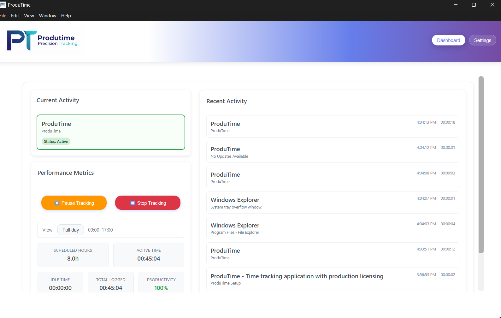
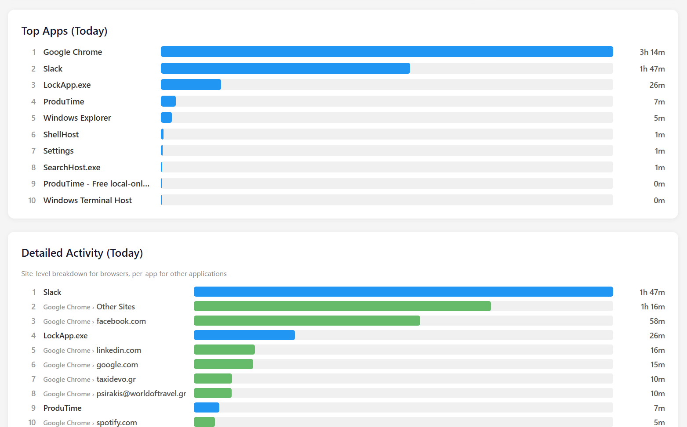
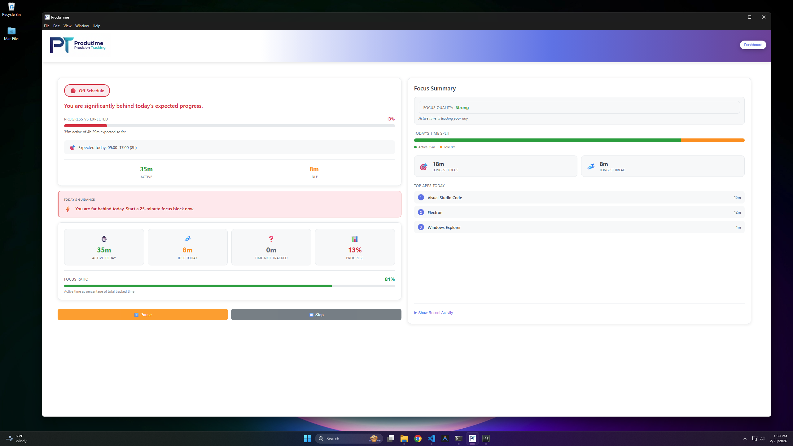
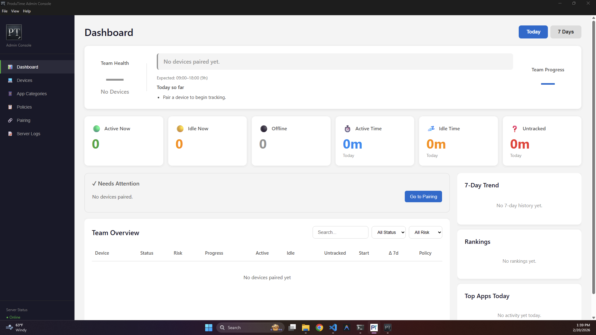

# ProduTime

Source-available proprietary freeware for local-first desktop time tracking and
productivity reporting on Windows.

ProduTime is developed by [George Karagioules](https://www.georgekaragioules.com)
and released as freeware. It is free to use, requires no activation key, and
does not require a subscription. The source may be visible for transparency, but
ProduTime is not open-source software and is not released under an open-source
license.

<p align="center">
  <a href="#build-from-source"><strong>Build from source</strong></a>
</p>

<p align="center">
  
</p>

## What It Does

ProduTime runs locally on a Windows desktop and helps users understand how time
is spent during the work day.

- Activity tracking for active windows, keyboard/mouse activity, and idle time
- Daily productivity summaries and schedule progress
- PDF reports for daily, weekly, monthly, and custom ranges
- Privacy mode for sensitive app/window titles
- Optional local/admin management features for controlled environments
- Optional update checks through GitHub Releases

## Screenshots

<p align="center">
  
  
  
</p>

## Download

No prebuilt installers are published for this repository at the moment. To use
ProduTime, build it from source as described in
[Build From Source](#build-from-source).

> ProduTime is proprietary freeware: free to install and use, but not open
> source. You may not modify, sublicense, sell, commercialize, or redistribute
> modified versions except where expressly permitted by the license or
> applicable law.

## Privacy Summary

ProduTime stores activity records, settings, reports, and local app data on the
user's device by default. It does not send telemetry, activity records, or usage
analytics to George Karagioules.

Network activity only happens when a user or administrator uses a networked
feature, such as update checks, admin-console pairing, external links, or
configured email/report delivery. See [PRIVACY.md](PRIVACY.md).

## Monitoring Other People

ProduTime records which applications and window titles are active, keyboard and
mouse activity, and idle time. If you use it to monitor employees or anyone
other than yourself, you must inform them and obtain their informed consent,
and you are responsible for complying with the privacy, employment and
data-protection laws that apply where you and they are (for example the GDPR in
the EU). Do not use ProduTime for covert monitoring.

## No Logins: Who Can See What

ProduTime, the Admin Console and the web admin console (`admin-web/`) have no
logins, passwords or sessions. Each one opens straight to its screens. Access is
controlled only by who can use the computer:

- **ProduTime (desktop app):** anyone who can use the Windows account it runs
  under, or who can otherwise use that PC and read its files, can open the
  dashboard, settings and reports and change settings.
- **Admin Console:** anyone who can use the PC it runs on can see the data of
  every paired device and change policies. ProduTime devices on the local
  network can still connect to it to send their data, but a device is only
  accepted after it pairs with a short-lived pairing code that you approve, and
  its messages are signed.
- **Web admin console (`admin-web/`):** it listens on `127.0.0.1` only and
  refuses requests from other computers and from other websites, so it can only
  be opened in a browser on the same PC. It cannot be deployed as a network or
  internet service.

Protect these PCs with their own Windows sign-in, and do not share the Windows
account ProduTime or the admin tools run under. Admin password data stored by
earlier versions is deleted automatically when you upgrade.

## Known Limitations

- Report-failure notifications and test emails are sent with the sender
  address `noreply@timeport.app` (from the project's former name), whatever
  SMTP account you configure. Some mail servers may reject or flag these
  messages.

## Tech Stack

| Layer | Technology |
|---|---|
| Desktop shell | Electron |
| UI | React + TypeScript |
| Local database | SQLite / SQLCipher |
| Bundler | Webpack |
| Installer | NSIS via electron-builder |
| Updates | electron-updater + GitHub Releases |

## Build From Source

### Prerequisites

- Node.js 18+
- npm 8+
- Windows 10+ for native activity-tracking behavior

### Install

```bash
npm install
npx @electron/rebuild --force --only better-sqlite3
```

### Build

```bash
npm run build:main
npm run build:renderer
```

### Run

```bash
npm start
```

### Package Installer

```bash
npm run dist:x64
```

Output:

```text
build-output/ProduTime-Setup.exe
```

## Project Structure

```text
src/
  main/           Electron main process, database, IPC, tray, updater
  renderer/       React UI
  shared/         Shared TypeScript types
assets/           Icons and images
admin-console/    Optional ProduTime Admin Console
admin-web/        Optional web admin console (this PC only)
scripts/          Build and maintenance scripts
```

## Disclaimer

ProduTime is provided "as is", without warranty of any kind, express or
implied. Use it at your own risk; the author is not liable for any damages,
data loss or legal consequences arising from its use. See the "No Warranty"
section of [LICENSE.txt](LICENSE.txt) for the full terms.

## License

ProduTime is proprietary freeware. See [LICENSE.txt](LICENSE.txt).

Third-party notices are listed in
[THIRD_PARTY_NOTICES.md](THIRD_PARTY_NOTICES.md).

Third-party dependencies, Electron/Chromium/Node components, and any files that
clearly state a separate license remain under their own license terms.

Copyright (c) 2026 George Karagioules. All rights reserved.
