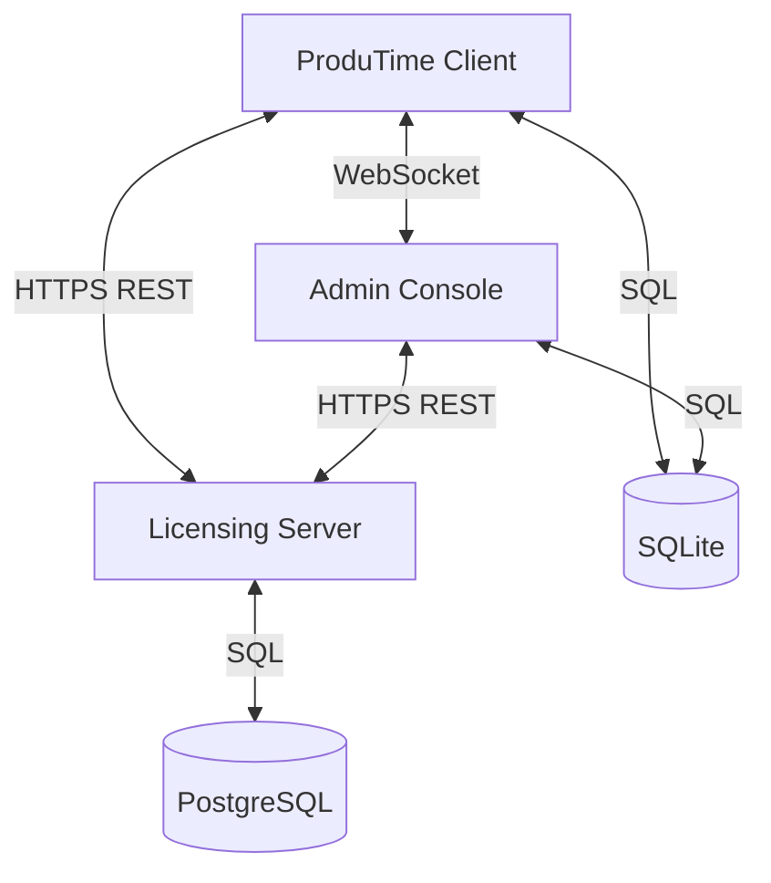

# ProduTime Technical Onboarding Guide

**Version:** 1.8.8  
**Last Updated:** January 2026  
**Status:** Production Ready

---

## 1. Introduction

Welcome to the ProduTime development team! This document serves as your comprehensive technical reference for the entire ProduTime ecosystem. ProduTime is an enterprise-grade time tracking and productivity monitoring solution designed with privacy and security at its core.

The ecosystem consists of three main components:
1.  **ProduTime Client**: The desktop application installed on end-user devices to track activity.
2.  **Admin Console**: A separate desktop application for administrators to manage devices and policies.
3.  **Licensing Server**: A cloud-based API that handles license activation, validation, and analytics.

---

## 2. Architecture & Tech Stack

### High-Level Architecture



### Technology Information

| Component | Technology | Key Libraries | Database |
|-----------|------------|---------------|----------|
| **Client** | Electron, React, TypeScript | `active-win`, `jsPDF`, `electron-updater` | SQLite (`better-sqlite3`) |
| **Admin Console** | Electron, React, TypeScript | WebSocket Server, Dashboard Charts | SQLite (`better-sqlite3`) |
| **Licensing Server** | Node.js, Fastify | Prisma ORM, `tweetnacl` (Ed25519) | PostgreSQL |

---

## 3. Component Deep Dive

### 3.1 ProduTime Client (The App)

The core application responsible for monitoring user activity.

**Key Features:**
*   **Activity Tracking**: polls the active window every 500ms using `active-win`. It records the App Name, Window Title, and Timestamp.
*   **Privacy Mode**: A critical feature that sanitizes window titles for sensitive apps (e.g., "Slack - Project X" becomes just "Slack"). Configurable via a `privacy_apps` list.
*   **Offline Capability**: Can store data locally and sync when online. Includes a 72-hour grace period for licensing checks.
*   **PDF Reporting**: Generates client-side PDF reports using `html2canvas` and `jsPDF` for privacy (data never leaves the device for reporting).

**Project Structure (`src/`):**
*   `main/`: Electron main process. Handles the database, `active-win` polling, and auto-updates.
*   `renderer/`: React frontend. The UI seen by the user.
*   `shared/`: Types and constants shared between processes.

### 3.2 Admin Console (The Panel)

A specialized Electron app for IT administrators and managers.

**Key Features:**
*   **Device Management**: View list of all active devices, their status (Online/Offline), and current activity.
*   **Pairing System**: Uses a 6-digit code system to securely pair Clients to the Admin Console via WebSocket.
*   **Policy Management**: Push settings to clients, such as:
    *   Work Schedules (e.g., 9 AM - 5 PM)
    *   Privacy Settings (Global privacy mode on/off)
    *   Idle Thresholds
*   **Dashboard**: Aggregated analytics showing team productivity, top performers, and attention-needed alerts.

**Communication**:
Runs a local WebSocket server on port **17888** to communicate directly with Clients on the same network (or tunneled).

### 3.3 Licensing Server (The Manager)

The source of truth for entitlements and security.

**Key Features:**
*   **Activation**: Validates license keys and binds them to a specific machine hash (Hardware ID).
*   **Heartbeat**: Clients check in every 12 hours. The server validates the status and can trigger **Revocation** or **Lockout**.
*   **Tamper Detection**: Detects if a license was copied to a different machine by verifying hardware components (CPU, Motherboard, etc.).
*   **API**: A REST API built with Fastify.

---

## 4. Key Implementation Details

### 4.1 Licensing System Logic

The system operates in three modes:
1.  **TRIAL (Default)**: 7-day free access. No server contact needed.
2.  **ACTIVATED**: A valid license key has been bound to the device.
    *   **Validation**: Local check (30s), Server check (30m), Heartbeat (12h).
    *   **Grace Period**: If the internet is lost, the app functions for 72 hours before locking.
3.  **LOCKED**: License expired, revoked, or tampering detected. App functionality is restricted.

**Security**:
*   All licenses and server responses are signed using **Ed25519** cryptography.
*   The Public Key is embedded in the client; the Private Key stays on the server.

### 4.2 Data Storage

*   **Client & Admin**: Uses **SQLite** with Write-Ahead Logging (WAL) for performance.
    *   *Table `activity_logs`*: Stores raw activity data.
    *   *Table `settings`*: Stores configuration.
*   **Server**: Uses **PostgreSQL** managed via **Prisma**.
    *   *Table `licenses`*: Stores customer entitlements.
    *   *Table `machines`*: Stores hardware hashes of activated devices.

### 4.3 Communication Protocols

*   **Main ↔ Renderer**: Typed IPC channels (e.g., `activity:getLogs`, `license:activate`). Defined in `src/shared/types.ts`.
*   **Client ↔ Admin**: Custom WebSocket protocol with signed messages (`PAIR_REQUEST`, `HEARTBEAT`, `POLICY_PUSH`).

---

## 5. Developer Workflow

### Quick Start Commands

```bash
# 1. Install Dependencies
npm install

# 2. Run Client App (Dev)
npm start

# 3. Run Admin Console (Dev)
cd admin-console
npm start

# 4. Build for Production
npm run dist:x64
```

### Testing

*   **Unit Tests**: `npm test` (Runs Jest)
*   **License Simulation**: `node scripts/simulate-license-scenarios.js` (Tests the state machine logic)

### Folder Structure Overview

```text
ProduTime/
├── src/                      # Client App Source
│   ├── main/                 # Node.js logic
│   └── renderer/             # React UI
├── admin-console/            # Admin Panel Source
├── licensing-server/         # Backend API Source
├── docs-root/                # Extensive Documentation
└── scripts/                  # Build & Test Scripts
```

---

*Refer to `docs-root/TECHNICAL_DOCUMENTATION.md` for specific function signatures and implementation details.*
